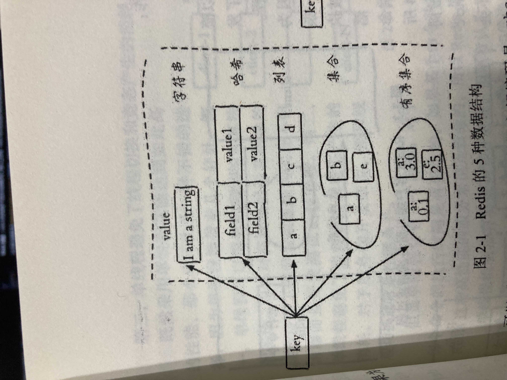

# 5 種資料結構

<br>

---

<br>

Redis 一共有 5 種資料結構：

* string (字串)

* hash (Hash Map)

* list (列表)

* set (集合)

* zset (有序集合)

<br>

__Redis 奧義：__  redis 針對每種不同資料結構都有 2 種以上實現，redis 可以在合適的場景使用合適的實現編碼。

list 資料結構包含 `linkedlist` ` ziplist` `quicklist` 三種編碼，查看資料結構的編碼可以用 `object encoding key` 查看:

<br>

```
127.0.0.1:6380> object encoding A
"embstr"
127.0.0.1:6380> object encoding B
"quicklist"
127.0.0.1:6380> 
```

<br>
<br>

五種資料結構的內部編碼

<br>

* string : `raw`, `int`, `embstr`

* hash : `hashtable`, `ziplist`

* list : `ziplist`, `linkedlist`, `quicklist`

* set : `hashtable`, `intset`

* zset : `skiplist`, `ziplist`

<br>
<br>

每種資料結構大致上長這樣：



<br>

ziplist 比較省內存但是效能比不上 linkedlist。redis 會根據配置選項將列表實現編碼在這二者間切換。